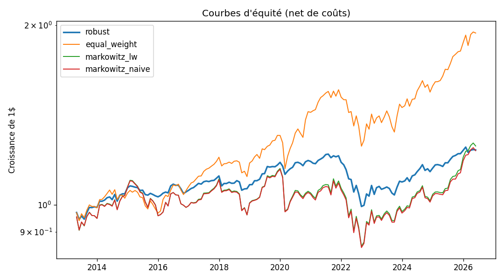
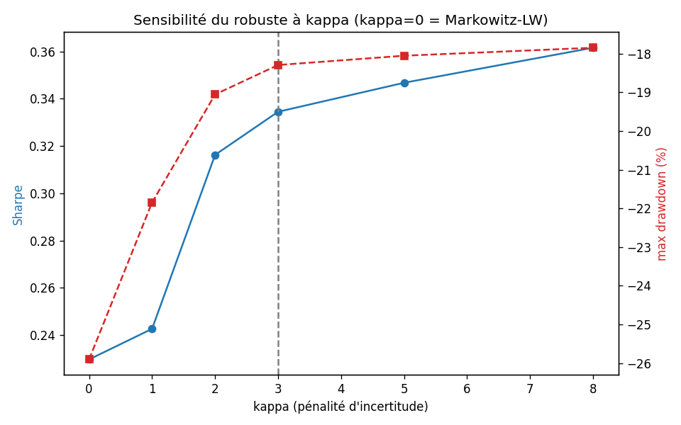

# portfolio-optim : Allocation de portefeuille sous incertitude

> **Résultat (une phrase).** Quantifier l'incertitude des prévisions de rendement
> et l'injecter dans un optimiseur robuste **répare l'instabilité de Markowitz** :
> sur un backtest 2013→2026, le Sharpe passe de 0.22 à **0.33**, le max drawdown
> de −26 % à **−18 %** et le turnover est **divisé par ~2.6** — un gain *attribué*
> à la couche incertitude (ablation) et *monotone* sur toute la plage du paramètre.
> Le 1/N reste un benchmark exigeant (Sharpe 0.62), discuté honnêtement plus bas.

Ce projet **n'est pas un benchmark de méthodes**. C'est une **décision**
d'allocation et la mesure de son **impact**. Les comparaisons d'architectures
(LSTM vs ARIMA, bootstrap vs MC Dropout vs VAE) sont des *détails d'implémentation*
documentés en annexe — une seule combinaison gagnante est mise en avant dans le
pipeline principal.

---

## Le pipeline en 4 couches

```
            ┌─────────────────────────────────────────────────────────────┐
 Couche 0   │  DONNÉES  (src/etl, src/features)                            │
            │  Univers d'ETFs → panel de prix/rendements propre (parquet)  │
            └─────────────────────────────────────────────────────────────┘
                                      │
            ┌─────────────────────────────────────────────────────────────┐
 Couche 1   │  FORECASTING  (src/models)                                   │
            │  Prévision des rendements attendus par actif                 │
            │  → gagnant mis en avant ; baselines (ARIMA, MA) en annexe    │
            └─────────────────────────────────────────────────────────────┘
                                      │
            ┌─────────────────────────────────────────────────────────────┐
 Couche 2   │  INCERTITUDE  (src/models)                                   │
            │  Quantification de l'incertitude de chaque prévision         │
            │  → distribution / intervalles qui alimentent l'optimiseur    │
            └─────────────────────────────────────────────────────────────┘
                                      │
            ┌─────────────────────────────────────────────────────────────┐
 Couche 3   │  OPTIMISATION  (src/optimization, cvxpy)                     │
            │  Allocation sous contraintes qui PÉNALISE l'incertitude      │
            │  (≈ robust / Bayesian mean-variance) → poids du portefeuille │
            └─────────────────────────────────────────────────────────────┘
                                      │
            ┌─────────────────────────────────────────────────────────────┐
 Couche 4   │  BACKTEST  (src/evaluation)                                  │
            │  Walk-forward vs 1/N et Markowitz naïf                        │
            │  → Sharpe, max drawdown, turnover, courbes d'équité          │
            └─────────────────────────────────────────────────────────────┘
```

La couche 2 est le cœur de la thèse : **l'incertitude n'est pas un diagnostic,
c'est un intrant de la décision.** Une prévision peu fiable doit se traduire par
une allocation plus prudente sur cet actif.

---

## Décisions de cadrage (figées)

| Sujet | Choix | Raison |
|---|---|---|
| **Univers** | ~17 ETFs hybrides par classe d'actifs (actions US/Europe/EM, oblig. govt/corp/IG/HY/TIPS, immobilier, or, matières premières, cash) | Diversification + historique long |
| **Période** | 2007 → aujourd'hui | Inclut la crise 2008 — meilleur stress-test du drawdown |
| **Devise (données)** | USD | CHF = reporting downstream (voir TODO) |
| **Benchmarks à battre** | **1/N** (plancher dur, DeMiguel 2009) **+ Markowitz max-Sharpe naïf** (repère d'instabilité) | Battre les deux = l'argument le plus fort |

Univers détaillé : voir [`src/config.py`](src/config.py).

---

## Résultats (backtest 2013→2026, 158 mois, net de coûts à 10 bps)

| Stratégie | Sharpe | Rend. ann. | Vol ann. | Max DD | Turnover |
|---|---|---|---|---|---|
| **robust** *(headline, incertitude-aware)* | **0.33** | 1.6 % | 5.2 % | **−18.3 %** | 0.56 |
| markowitz_lw *(LW, sans pénalité)* | 0.23 | 1.7 % | 9.5 % | −25.9 % | 1.17 |
| markowitz_naive *(cov. échantillon)* | 0.22 | 1.6 % | 9.4 % | −26.0 % | 1.17 |
| equal_weight *(1/N)* | 0.62 | 5.2 % | 8.7 % | −19.6 % | 0.02 |

**Ce que ça démontre.** La chaîne d'ablation isole l'apport de chaque ingrédient :
`robust` (0.33) > `markowitz_lw` (0.23) > `markowitz_naive` (0.22). Le gain vient
donc bien de la **couche incertitude**, pas du seul shrinkage. Et il est
**monotone** : balayer la pénalité κ de 0 à 8 fait monter le Sharpe de 0.23 à 0.36,
descendre le drawdown de −26 % à −18 % et le turnover de 1.17 à 0.45
(`results/figures/sensitivity_kappa.png`) — ce n'est pas un point isolé bien choisi.

**Honnêteté.** Le **1/N bat les stratégies optimisées** (Sharpe 0.62). Les
optimiseurs deviennent défensifs (vol 5 %, lourds en obligations) car le signal de
rendement est faible et l'aversion au risque les pousse vers le min-variance ; ils
ratent en partie le marché haussier actions 2013-2026. C'est le résultat classique
de DeMiguel et al. (2009) : 1/N est un benchmark redoutable. Le projet **ne le
masque pas** — la contribution démontrée est que *quantifier l'incertitude répare
l'instabilité de Markowitz*, pas que l'optimisation batte 1/N. Fermer cet écart
proprement est un travail futur assumé (voir TODO).



À gauche → droite de κ, le robuste gagne en Sharpe et perd en drawdown/turnover,
sans rupture — la conclusion ne tient pas à un κ choisi à la main :



Autres figures : `results/figures/drawdowns.png`,
`results/figures/uncertainty_calibration.png`.

### Tient-il sur tous les régimes ? (`make subperiods`)

Le résultat n'est pas l'artefact d'une période chanceuse. Face à la **famille
Markowitz**, le robuste mène dans 3 régimes sur 5, traîne marginalement dans 2 :

| Régime | Métrique | robust | meilleur Markowitz | Verdict |
|---|---|---|---|---|
| Full 2013-2026 | Sharpe | 0.33 | 0.23 | **mène** |
| Bull 2013-2019 | Sharpe | 0.58 | 0.30 | **mène** |
| Crash COVID 2020 | perte cumulée | **−1.0 %** | −8.8 % | **mène (nettement)** |
| Post-2020 | Sharpe | 0.15 | 0.18 | traîne (−0.02) |
| Choc de taux 2022 | perte cumulée | −8.5 % | −7.7 % | traîne (−0.8 pt) |

Point fort : pendant le **crash COVID**, le robuste ne perd que **−1 %** contre
**−9 %** pour Markowitz (et −2 % pour le 1/N) — la prudence face aux prévisions
incertaines paie quand le marché décroche. Détail : `results/metrics/subperiod_metrics.csv`.

---

## Structure

```
portfolio-optim/
├── data/
│   ├── raw/          # prix bruts téléchargés (gitignored)
│   └── processed/    # panel propre : prices / returns / coverage (parquet)
├── src/
│   ├── config.py     # source unique : chemins, dates, univers
│   ├── etl/          # ✅ couche 0 — téléchargement & nettoyage
│   ├── features/     # ✅ couche 0 — construction de features
│   ├── models/       # ✅ couches 1-2 — forecasting + incertitude
│   ├── optimization/ # ✅ couche 3 — allocation robuste (cvxpy)
│   └── evaluation/   # ✅ couche 4 — backtest, sensibilité & métriques
├── notebooks/        # exploration uniquement
├── results/          # figures/ & metrics/ (gitignored)
├── tests/
├── Makefile
└── requirements.txt
```

---

## Démarrage

```bash
python -m venv .venv && source .venv/bin/activate
make setup      # dépendances épinglées
make data       # télécharge & nettoie l'univers -> data/processed/
make test       # tests ETL (sans réseau)
make help       # liste toutes les targets
```

Targets du pipeline : `data` → `features` → `forecast` → `uncertainty`
→ `optimize` → `backtest` (`make all`) ; robustesse : `make sensitivity`, `make subperiods`.

---

## État & TODO

- [x] **Couche 0 — Données** : ETL yfinance, nettoyage (jours fériés / NaN),
      sortie parquet + rapport de couverture, tests.
- [x] **Couche 0 — Features** : momentum (1/3/6/12m, 12-1), vol & downside-vol
      glissantes, écart MA200, drawdown 1 an ; cible = rendement fin-de-mois →
      fin-de-mois (non chevauchant), contrat anti-fuite testé. Horizon **mensuel**.
- [x] **Couche 1 — Forecasting** : modèle de tête = **ML poolé cross-sectionnel**
      (GBM), walk-forward à fenêtre expansive sans fuite, métriques orientées
      allocation (IC, IR, hit-rate, RMSE). Annexe = ridge / moving-average /
      historical-mean derrière la même interface. ARIMA & LSTM/Transformer : à
      brancher en annexe (interface prête).
- [x] **Couche 2 — Incertitude** : méthode de tête = **bootstrap ensemble du
      GBM** (B=30). Sépare σ épistémique (fiabilité de μ, par actif → intrant de
      l'optimiseur) et σ aléatoire (résidus out-of-bag). Calibration vérifiée
      (légèrement conservative). MC Dropout / quantile : annexe.
- [x] **Couche 3 — Optimisation** : mean-variance **robuste** (cvxpy) pénalisant
      σ épistémique via un terme conique ; Σ Ledoit-Wolf ; long-only, pleinement
      investi, plafond 30 %/actif. Ablation `markowitz_lw` (LW sans pénalité) +
      `markowitz_naive` (cov. échantillon) + 1/N.
- [x] **Couche 4 — Backtest** : walk-forward, rebalancement mensuel, coûts 10 bps,
      turnover drift-aware ; Sharpe / max DD / Calmar / turnover + **balayage de κ**
      (sensibilité). Verdict attribué et monotone.
- [ ] **Reporting CHF** : conversion USD→CHF des courbes d'équité finales.
- [ ] **Fermer l'écart 1/N** (travail futur) : signal de rendement plus fort,
      ou ciblage de volatilité pour une comparaison à risque égal.
- [ ] **Annexe** : tableau comparatif des méthodes (architectures, incertitude),
      ARIMA & LSTM/Transformer, aléatoire par actif.

---

## Lignée

Extension de `immo_antibes` (benchmark LSTM/GRU/Transformer/MA + MC Dropout sur
séries immobilières). La leçon retenue : **ne pas s'arrêter au benchmark.** Ici,
le livrable est une allocation et son impact mesuré, pas un classement de modèles.
```
